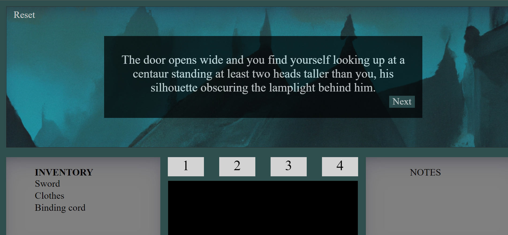
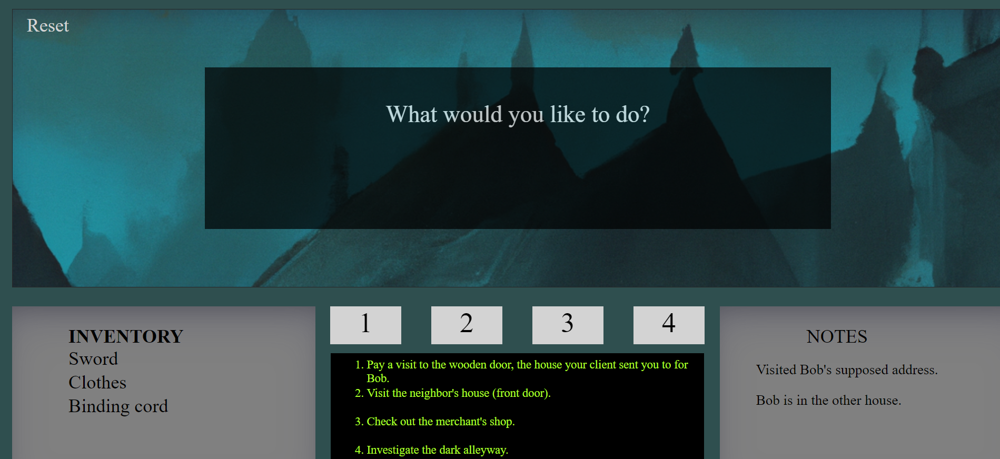

README

Git a Bob (A Choose-Your-Own Adventure Game)
This is a choose-your-own fantasy adventure game taking place in a fictional mountain village, with you (the player) as a bounty hunter set out to capture and return your latest target, "Bob". With multiple possible storylines, you'll have the opportunity to play the game over and over, yielding varying results.

Link
Play this game on the Git page! https://caution73.github.io/mod1_story_project/

Motivation
Having been heavily influenced throughout my life by the fantastic video games I played, the movies I watched, and the books that I read, I have always wanted to create my own story that I could share for others to enjoy. I've always had a fondness for games that would dramatically change based on the decisions you make within them, so here's my take on that concept!

Screenshots

Features
The most significant features that I would say this game has would be its randomly selected story line, with various endings depending on your choices. Immerse yourself in the story, and remember that the next time you play it, you may get an entirely different experience.

Installation
Visit the GitHub repository at https://github.com/caution73/mod1_story_project, where you can fork the code and/or download the code to your own computer.

Contribute
If you would like to contribute to the development of this project, I would be thrilled to have additional artwork that can be used in each "scene". Other ways you can help would be through enhanced CSS, refactored code (I'm always happy to see more efficient ways to run this game!), or even continuing the story line of the game! For additional details, please see "Stretch Goals" below.

Unresolved Problems
Though the story functions essentially how I desired, I did run into several issues during development that I ultimately had to find workarounds for rather than truly resolving them.  I initially wanted to assign the 4 "choice" buttons to whatever I needed to for the given decision. However, after many failures at getting that to work, I ultimately resorted to giving the "choice" buttons fixed values (locations). This ultimately resulted in less mobility/freedom for the player, as well as requiring assistance from window.confirm for several storylines. I hope to resolve this sometime soon.

Stretch Goals
Aspirational improvements for the game include:

Adding music/sound effects based on what's happening in the game.
Adding addional images to be displayed based on what's happening in the game.
Improving the GUI to be more appealing and user-friendly.
Refactoring the code to be more efficient and easy-to-read.
Adding a splash page / start menu.
Developing the current story in ways that can utilize additional inventory and player stats (such as health, defense, etc.)

Credits
I'd like to thank all those that have helped me debug and test the game, as well as those that have taken the time to play the game. I hope that this story has provided you with a memorable experience...and if it hasn't yet, come back to try it later. It will only be improving!